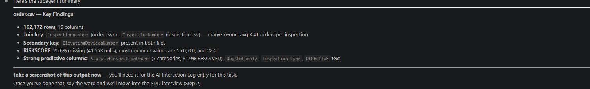

# AND-101 Generative AI Fundamentals

# AI Interaction Log

This file records prompts submitted to AI tools and the outputs they produced during the development of RocketDash. Each entry notes the date, the tool used, the prompt, and a summary of the result.

---

## Entry 1 — 2026-05-11

**Tool:** Claude (claude-sonnet-4-6)

**Task 1**

**Prompt:**
> Generate a README.md that includes: the project name, a one-paragraph description of the project, and a list of the four directories with what each one contains. Also create this file, docs/ai-interaction-log.md.

**What Happened:**
Claude generated `README.md` at the project root with the project name "RocketDash", a one-paragraph description covering the project's purpose (replacing manual spreadsheet workflows with an internal Operations Dashboard), and a table describing the four directories: `data/`, `docs/`, `intelligence/`, and `platform/`. Claude also created this `docs/ai-interaction-log.md` file to track AI-assisted work going forward.

**What I Would Change:**
I would have been more specific with the prompt and described exactly how I wanted the README.md file structured.  Currently there is no title inside of the document.  I would have said at the top of the document write Project: Rocket Dashboard.  Beneath it create a section named Project Description, and describe the Project in one paragraph based on these paramaters. I would have paraphrased the requirements fromm the Business Document.  Next, I would have requested that another section be created named Project Directory with a listing of the directory.  Finally, I would have requested that the fourth section be labeled as Commit and requested that the commit identify the most recent commit in detail.

---

## Entry 2 — 2026-05-13

**Tool:** Claude (claude-sonnet-4-6)

**Task 1**

**Prompt:**
> Please update the README file with the following criteria — Title: Rocket Dash. Section 1 - Project Description: Write one paragraph summarizing the project scope and the client's direct request. Section 2 - Directory Listing: Create a listing of the four project directories with descriptions. Section 3 - Commit Description: Provide an explanation of the first commit after the initial commit.

**What Happened:**
Claude read the existing README.md and rewrote it with the requested structure. The title was updated to "Rocket Dash". A Project Description section was written synthesizing the project scope and the client's verbatim request into a single paragraph. A Directory Listing section was added as a table with the four directories (`platform/`, `intelligence/`, `data/`, `docs/`) and their contents. For the Commit Description section, Claude ran `git log` to identify the commits, then read the file added in commit `81b206b` (`docs/ai-workflow-baseline.md`) to accurately summarize what was done. The section was initially placed before the Directory Listing in error; after user correction it was placed in the correct order following the Directory Listing.

**What I Would Change:**
I would not change anything for this prompt.  The output was accurate.

---

## Entry 3 — 2026-05-13

**Tool:** Claude (claude-sonnet-4-6)

**Task 1**

**Prompt:**
> Create dashboard_spec.md file in the docs folder. Detailed requirements: Read the operations manager's request in the Business Context section. Identify what they need to see on the dashboard. Write docs/dashboard_spec.md that translates that request into a technical specification. The spec must include: page layout (sidebar, summary metrics, detail table), table columns with data types and display formats, summary cards with how each is calculated. Write in plain English, detailed enough that Claude Code can generate the dashboard without asking clarifying questions.

**What Happened:**
Claude inspected the three relevant dataset files (`license.csv`, `inspection.csv`, `installed.json`) to identify available fields, data types, and distinct values before writing the spec. It confirmed that elevator type information lives in `installed.json` (field: `Device Type`) and that `DeviceStatus` in the same file is the source for active/inactive status. The resulting `docs/dashboard_spec.md` defined: a fixed left sidebar with navigation, a main content area with a page heading, three summary cards (Total Elevators, Active Elevators, Overdue Inspections), and a searchable detail table. Each table column was documented with its source file, source field name, data type, and display format. Join logic across all three data files was specified using the Elevating Device Number as the common key.

**What I Would Change:**
I would have read the business requirements document more thoroughly before writing this prompt. The spec was generated without the 12-month overdue inspection rule, which required a separate correction in Entry 4. Including all business rules in the initial prompt — rather than discovering omissions after the fact — would have produced a complete spec in one pass. In future spec tasks I will compile all business rules into a checklist before prompting.

---

## Entry 4 — 2026-05-13

**Tool:** Claude (claude-sonnet-4-6)

**Task 1**

**Prompt:**
> I did not see how we approached this challenge in the spec doc: For this project, the operations manager considers an elevator overdue if more than 12 months have passed since its last periodic inspection.

**What Happened:**
Claude updated the Overdue Inspections card definition in `docs/dashboard_spec.md`. The original definition used license expiry date as the overdue criterion, which did not reflect the actual business rule. The updated definition specifies: find the most recent record per elevator in `inspection.csv` where `InspectionType` equals `"ED-Periodic Inspection"`; if that record's `Latest_INSPECTION_Date` is more than 12 months before today, the elevator is overdue. Elevators with no periodic inspection on file are also counted as overdue.

**What I Would Change:**
This entry exists entirely because of an omission in Entry 3. The business rule defining "overdue" was stated clearly in the requirements but was not included in the original spec prompt. I would not change how this correction was handled — Claude updated the spec accurately — but I would eliminate the need for this entry entirely by being more thorough when reading requirements before writing a spec. This is a good example of how a vague prompt creates rework.

---

## Entry 5 — 2026-05-13

**Tool:** Claude (claude-sonnet-4-6)

**Task 1**

**Prompt:**
> Generate platform/index.html file using Tailwind CSS styling. This is a static prototype of the dashboard, therefore use placeholder data. Invent sample elevator records for the time being.

**What Happened:**
Claude created `platform/index.html` as a fully static prototype of the Fleet Overview dashboard. The file uses Tailwind CSS loaded via CDN. The layout follows the dashboard spec: a fixed left sidebar with the app name and navigation links (Fleet Overview as active, with placeholder links for Inspections, Incidents, and Alterations), a top header, three summary cards (Total Elevators, Active Elevators, Overdue Inspections), and a searchable detail table. Twenty-four invented elevator records were used as placeholder data, covering a range of locations in Toronto and Mississauga, all device types and status values from the real dataset. Status values are displayed as color-coded badges. A live search input filters table rows by Elevator ID or Location as the user types. The file requires no server and can be opened directly in a browser.

**What I Would Change:**
The prompt I submitted generated a good base for  the dashboard. It contained the required elements and delivered exactly what the prompt requested. In terms of additional functionality such as sorting the dashboard can be challenging to navigate. For instance, the client wants to be able to get a snapshot of data by  group such as active, inactive, expired liscence, TSSA Shutdown, and Customer Shutdown. A sort feature will be an excellent  addition.  It was not explained in the prompt and not intuitively administered. In addition Claude generated three summary cards and those cards represent total  elevators, active elevators, and expired liscences.  This is what the client requested but to make the dashboard more interactive the clards cn be clickable and sort the table on click.  Since those are the main pieces of data the client would like to use they should be easily and readily accessible.  Easch summary card only shows the total number of each respective subject. It could be beneficial to add "heads up" data such as 5 Elevators added in the last thirty days, or 5 licences to be added soon.  I am going to refine the prompt and spec doc to be more specific.  In addition I will add specific features to sections individually.  For instance summary cards should be clickable and sort the data in the table respectively.

---

## Entry 6 — 2026-05-14

**Tool:** Claude (claude-sonnet-4-6)

**Task 1**

**Prompt:**
> Currently the header reads Fleet Overview. Change Fleet Overview to Dashboard. Underneath the word Dashboard add a small sub text 10px that says Rocket Dashboard Day of the Week (Thursday), Month (May), Current Day (14), Year (2026). The text should be on the left of the dashboard. Add the same icon used in the navigation menu to the left of the word Dashboard. Change the icon in both the navigation menu and header to four squares. Move the search bar currently located on the table to the right side of the dashboard header. Add these specifications to the docs/dashboard_spec.md document.

**What Happened:**
Claude updated `platform/index.html` with all requested changes. The nav item icon was replaced with a four-squares grid icon and its label changed from "Fleet Overview" to "Dashboard". The header was rebuilt as a flex row: the left side now shows the grid icon alongside the "Dashboard" title and a 10px muted subtext reading "Rocket Dashboard — Thursday, May 14, 2026"; the right side holds the search input, relocated from the table section. The table section header was simplified to just the "Elevator Details" label. `docs/dashboard_spec.md` was updated to reflect the new nav label, grid icon usage, header layout, subtext format, and search bar placement.

**Task 2**

**Prompt:**
> Add a magnifying glass inside of the search bar.

**What Happened:**
Claude wrapped the search input in a relative-positioned container and added a magnifying glass SVG icon absolutely positioned on the left interior of the input field. The input padding was adjusted to prevent text from overlapping the icon.

**What I Would Change:**
AI generated exactly what was requested in the prompt.  Typically search bars have the magnifying glass as an icon and that was not added with the initial prompt, so I added it with a second prompt.  Other than that everything worked perfectly.

---

## Entry 7 — 2026-05-14

**Tool:** Claude (claude-sonnet-4-6)

**Task 1**

**Prompt:**
> When the user first logs into the dashboard the Total Elevators Card should be highlighted. Currently, I am not in possession of the brand standard colors but we can use a light shade of blue with white and/or light gray text. All of the summary cards should be clickable and when a specific card is selected it should sort the table accordingly. If active elevators is selected, then only active elevators should be shown in the table.

**What Happened:**
Claude added click interactivity to all three summary cards. On load, the Total Elevators card is highlighted with a blue background and white text as the default selected state. Clicking any card highlights it in blue and filters the detail table to match — Total Elevators shows all records, Active Elevators shows only records with `DeviceStatus = "Active"`, and Overdue Inspections shows only records whose last inspection date is more than 12 months ago. Only one card can be selected at a time. The search bar continues to work in combination with the active card filter.

**Task 2**

**Prompt:**
> Awesome! When I click on Overdue Inspections it shows a total of 7 elevators but the card says that there is 5.

**What Happened:**
Claude identified that the card counts were hardcoded as static values, causing a mismatch with the filter logic. All three card counts were updated to be computed dynamically from the data at load time. The Overdue Inspections card now correctly displays 7, matching the number of rows shown when that card is clicked.

**Task 3**

**Prompt:**
> Update the docs/dashboard_spec.md file to show the behavior required for summary cards.

**What Happened:**
Claude updated the Summary Cards section of `docs/dashboard_spec.md` to document the full interactivity: dynamic count calculation at load time, default selected state for Total Elevators, blue highlight styling for the selected card, single-selection behavior, per-card filter logic, and how the search input works in combination with the active card filter.

**What I Would Change:**
The card count mismatch in Task 2 of this entry was a preventable bug. The initial prompt did not specify that card counts should be calculated dynamically from the data — it only described the visual behavior. As a result, Claude hardcoded the counts, which immediately became inconsistent with the filter output. In future prompts involving counts or metrics I will explicitly state "compute dynamically from the data" to prevent static values from being used. I would also have included the spec update request (Task 3) in the original prompt rather than as a follow-up.

---

## Entry 8 — 2026-05-14

**Tool:** Claude (claude-sonnet-4-6)

**Task 1**

**Prompt:**
> I want to update the summary cards to Total Elevators, Operational Elevators, Non-Operational Elevators, Overdue Inspections. Would this conflict with Task 5?

**What Happened:**
Claude explained that the dashboard update and Task 5 operate in completely separate parts of the project — the dashboard lives in `platform/` while Task 5 is a Jupyter notebook in `intelligence/`. No conflict exists. Claude noted that Task 5's classification task will define which license statuses are operational vs. non-operational, which could inform the dashboard cards. Two options were presented: update the dashboard now using best-judgment classifications, or complete Task 5 first to establish data-driven definitions before building the new cards. The user decided to finish dashboard tasks first and drill down on functionality afterward.

**What I Would Change:**
I would have mapped out the dependencies between tasks before starting any implementation work. Task 5's classification output directly informs what the dashboard cards should be named and how they should filter — had I completed Task 5 first, the dashboard card definitions would have been data-driven rather than assumption-based. In future projects I will identify which tasks produce outputs that other tasks depend on, and sequence them accordingly.

---

## Entry 9 — 2026-05-14

**Tool:** Claude (claude-sonnet-4-6)

**Task 1**

**Prompt:**
> Update the summary cards to 4 with the following categories: Total Elevators, Operational Elevators, Non-Operational Elevators, Overdue Inspections.

**What Happened:**
Claude updated the summary cards from 3 to 4, changing the grid to `grid-cols-4`. The "Active Elevators" card was renamed to "Operational Elevators" (filtering to `DeviceStatus === "Active"`). A new "Non-Operational Elevators" card was added filtering to all elevators where `DeviceStatus` is not "Active", using an orange x-circle icon. All card counts and filter logic were updated accordingly.

**Task 2**

**Prompt:**
> Add one more card that shows expired licence. Use a 3 column grid format and make the height of Total Elevators match two rows. Stack the remaining cards two on top of two.

**What Happened:**
Claude added an "Expired Licences" card with a purple ban icon, filtering to elevators where `licenseExpiry` is before today. The grid was restructured to 3 columns with Total Elevators spanning 2 rows on the left, and the four remaining cards arranged in a 2×2 grid in columns 2 and 3. The Total Elevators count number was increased to `text-6xl` to fill the taller card height. The `selectCard` function was updated to preserve `row-span-2` and `flex flex-col justify-between` classes on the Total Elevators card across state changes.

**Task 3**

**Prompt:**
> Add a sorting feature to the Elevator Details table. Place it on the right side of the table header as a dropdown. Add all filterable labels to the options.

**What Happened:**
Claude added a "Sort by…" dropdown to the right side of the Elevator Details table header. Initial implementation included ascending and descending options per column, which was simplified after user feedback to just the six column labels (Elevator ID, Location, Type, Status, License Expiry, Last Inspection). Selecting a field sorts the table ascending by that field, in combination with the active card filter and search.

**Task 4**

**Prompt:**
> In the license expiry column highlight the expired licenses in red.

**What Happened:**
Claude updated the `renderTable` function to check each elevator's `licenseExpiry` date against today. Expired dates are rendered in red bold text; valid dates remain in the default gray.

**What I Would Change:**
This entry involved four separate prompts that could have been consolidated into two. The card restructuring (Tasks 1 and 2), the sort dropdown (Task 3), and the license expiry highlighting (Task 4) are all independent features. I could have included the sort dropdown and expiry highlighting requirements in the initial card restructuring prompt, reducing the number of back-and-forth exchanges. Going forward I will group related visual and behavioral changes into a single well-structured prompt rather than making incremental requests.

---

## Entry 10 — 2026-05-14

**Tool:** Claude (claude-sonnet-4-6)

**Task 1**

**Prompt:**
> Update the docs/dashboard_spec.md file with the following: There will be 5 Summary Cards — Total Elevators, Active Elevators, Inactive Elevators, Overdue Inspections, Expired Licence. Each card will contain additional data showing how many elevators are operational and non-operational.

**What Happened:**
Claude updated `docs/dashboard_spec.md` to reflect the renamed cards (Active Elevators replacing Operational Elevators, Inactive Elevators replacing Non-Operational Elevators) and added a Sub-data section specifying that each card displays a secondary line in the format "X Operational · Y Non-Operational" for that card's filtered subset. The grid layout diagram and all five individual card descriptions were updated accordingly.

**Task 2**

**Prompt:**
> Update the platform/index.html file with the new features for the summary cards. Reference docs/dashboard_spec.md for instructions.

**What Happened:**
Claude regenerated the summary cards in `platform/index.html` from the updated spec. Cards were renamed (Active Elevators, Inactive Elevators), all IDs and filter keys updated accordingly, and a `subData()` helper function was added to compute the operational breakdown for any subset of elevators. Each card received a sub-data `<p>` element displaying "X Operational · Y Non-Operational" in `text-xs` — white when the card is selected, muted gray when unselected. The `selectCard` function was updated to toggle sub-data text color alongside the other card elements.

**Task 3**

**Prompt:**
> The sub data should reflect operational and non-operational.

**What Happened:**
Claude updated the `subData()` function in `platform/index.html` to use the labels "Operational" and "Non-Operational" instead of "Active" and "Inactive". The `docs/dashboard_spec.md` sub-data format, definition lines, and all five card descriptions were updated to match.

**What I Would Change:**
The label correction in Task 3 was avoidable. The spec already used "Operational" and "Non-Operational" terminology — the prompt for Task 2 should have referenced those exact terms rather than allowing Claude to default to "Active" and "Inactive". I would have been more precise in the original implementation prompt, explicitly stating the sub-data labels rather than leaving that detail open to interpretation. This entry is a good example of how ambiguity in a prompt produces output that requires correction.

---

## Entry 11 — 2026-05-14

**Tool:** Claude (claude-sonnet-4-6)

**Task 1**

**Prompt:**
> Update the docs/dashboard_spec.md with the following: add sorting buttons in the header of the Elevator Details table to sort latest, oldest, A-Z, and Z-A. Add these buttons to the left of the sort dropdown.

**What Happened:**
Claude updated `docs/dashboard_spec.md` to document four sort direction buttons (Latest, Oldest, A→Z, Z→A) in the table header bar, positioned between the "Elevator Details" label and the sort dropdown. `platform/index.html` was then updated to implement the buttons with active-state highlighting and combined sort logic integrating with the dropdown, card filter, and search.

**Task 2**

**Prompt:**
> The Latest and Oldest buttons seem to target only inspection dates which can be misleading. Let's drop Newest and Oldest. Update the spec first.

**What Happened:**
Claude explained that Latest/Oldest were tied to `lastInspection` regardless of dropdown context, making them confusing. The spec was updated to remove them, leaving only A→Z and Z→A. The HTML was then updated to match — removing the two buttons and simplifying the sort logic to a single direction-aware function.

**Task 3**

**Prompt:**
> Would it make more sense to just have an up arrow and down arrow? Yes — update the spec first then the HTML.

**What Happened:**
Claude updated `docs/dashboard_spec.md` to replace A→Z and Z→A labels with ↑ and ↓ arrows, noting they are direction-agnostic and work equally well for text, numbers, and dates. `platform/index.html` was updated to display ↑ and ↓ as the button labels.

**What I Would Change:**
This entry went through three iterations — four buttons reduced to two, then relabeled — because the initial prompt did not think through how sort direction buttons would behave across different data types. Latest/Oldest only made sense for dates, not for text columns, which made them misleading. I would have considered the full range of column types before specifying button labels. A better initial prompt would have described the intended behavior (sort the selected column in ascending or descending order) rather than prescribing specific labels, allowing Claude to suggest the most appropriate UI.

---

## Entry 12 — 2026-05-15

**Tool:** Claude (claude-sonnet-4-6)

**Task 5 — Prompting Lab**

**Prompt:**
> Explain the three prompting techniques — zero-shot, few-shot, and chain-of-thought — and walk me through how to apply each one to the three data analysis tasks using the Ontario elevator license dataset.

**What Happened:**
Claude explained each technique in depth before writing anything into the notebook. Zero-shot was described as asking the question directly with no examples or reasoning instructions. Few-shot was described as embedding 2–3 examples of the desired output format inside the prompt before asking the question. Chain-of-thought was described as instructing the model to reason step by step before giving a final answer. Claude then walked through all three tasks (classification of LICENSE STATUS values, calculation of expired license percentage, and geographic distribution analysis) applying each technique individually. For each task, Claude explained what data to provide in the prompt and why, then wrote the prompt-output pairs into `intelligence/prompting_lab.ipynb`. After all nine pairs were completed, a comparison section was written identifying chain-of-thought as the strongest technique across all three tasks and few-shot as the technique that added the least value — with specific evidence from the outputs cited for each conclusion.

**What I Would Change:**
I would have started with a clearer understanding of what data to include in each prompt before beginning. Early in the task I was unsure whether to reference the CSV file by name or paste the actual values — understanding that Claude cannot read files directly and that the data must be provided in the prompt itself would have saved time. In future tasks I would inspect the dataset first, extract the relevant values, and have them ready before writing any prompts.

---

## Entry 13 — 2026-05-15

**Tool:** Claude (claude-sonnet-4-6)

**Task 6 — License Dataset Analysis**

**Prompt:**
> Walk me through each question in Task 6 and write the solutions into intelligence/license_analysis.ipynb with working code and justifications.

**What Happened:**
Claude walked through all five questions before writing any code, explaining the purpose and procedure for each. For question (a), Claude loaded `data/license.csv` into a pandas DataFrame and tested both `ElevatingDevicesNumber` and `ElevatingDevicesLicenseNumber` for uniqueness using `nunique()`, confirming that `ElevatingDevicesNumber` was the correct primary key. For question (b), Claude used `str.split().str[-1]` and `str.split().str[-2]` to extract the country and province from the location string, confirming the majority of elevators are in Ontario, Canada. For question (c), Claude used `value_counts()` to examine all 11 LICENSE STATUS values and filtered the DataFrame to keep only ACTIVE (42,665 rows) and PENDING_RENEWAL (632 rows), justifying each kept and removed status by name with a specific reason. For question (d), Claude re-verified that `ElevatingDevicesNumber` remained unique after filtering and explained the scenario under which filtering could have broken uniqueness. For question (e), Claude parsed `LICENSEEXPIRYDATE` using `pd.to_datetime()`, grouped by year using `dt.year`, and produced a labeled bar chart with a data-derived time axis. The notebook was then executed from the terminal using `jupyter nbconvert` and ran without errors.

**What I Would Change:**
I initially did not understand that pandas was required and needed an explanation of what it is before proceeding. In future data analysis tasks I would familiarize myself with the required libraries beforehand so that setup time is reduced. I would also run the notebook sooner in the process rather than waiting until all five questions were complete — running after each section would catch errors earlier and confirm outputs before moving on.

---

## Summary

This log covers 13 interactions with Claude (claude-sonnet-4-6) across Tasks 1, 5, and 6 of the RocketDash project. The interactions ranged from generating project documentation and building a static HTML dashboard to applying prompting techniques in a Jupyter notebook and performing data analysis on the Ontario elevator registry. Reviewing the entries as a whole reveals five consistent patterns — both in how AI tools were used effectively and where the approach fell short.

---

### Pattern 1 — Incomplete prompts caused the most rework

The single most common source of extra work across this log was prompts that omitted key requirements. Entry 3 produced a dashboard spec missing the 12-month overdue inspection rule, requiring a full correction in Entry 4. Entry 7 produced hardcoded card counts because dynamic behavior was never specified. Entry 10 used incorrect labels because the exact terminology from the spec was not referenced in the prompt. In every case the AI did exactly what was asked — the problem was not the output but the input. Vague or incomplete prompts consistently produced outputs that required correction, which cost more time than writing a complete prompt would have.

**Lesson:** Before submitting a prompt, treat it like a requirements document. Ask: what should the output look like? What business rules apply? What terminology should be used? What behavior is expected across all edge cases? The more specific the prompt, the fewer corrections are needed.

---

### Pattern 2 — Task dependencies were not planned upfront

Entry 8 documents a moment where a dashboard update was almost made before completing Task 5, which would have produced card definitions based on assumptions rather than data. The operational vs. non-operational classification that Task 5 was designed to establish is exactly what the dashboard cards needed. Had the tasks been sequenced correctly — Task 5 first, then dashboard refinement — the card definitions would have been data-driven from the start. The same issue appears in Entry 3, where the dashboard spec was written before all business rules had been extracted from the requirements document.

**Lesson:** Before beginning any task, identify which other tasks it depends on and which tasks depend on it. Build the dependency chain before touching the code or the prompts.

---

### Pattern 3 — Iterative refinement is a feature, not a failure

Several entries show features being built in multiple passes — the sort buttons went through three iterations in Entry 11, the summary cards were updated across four separate entries, and the sub-data labels required correction after implementation. While some of these iterations were caused by incomplete prompts, others were the result of genuinely discovering better solutions through use. The ↑ and ↓ arrows were an improvement over A→Z and Z→A that only became obvious after seeing the buttons in context. This is normal when building with AI tools. The first version of something is rarely the final version. What matters is that each iteration is logged, reviewed, and reflected on.

**Lesson:** Expect iteration. The goal is not to get it right in one prompt but to move toward the right solution efficiently. Logging each change makes the reasoning traceable and helps distinguish planning failures from genuine refinement.

---

### Pattern 4 — Asking for explanation before implementation improved understanding

A consistent practice across Tasks 5 and 6 was asking Claude to explain concepts and procedures before writing any code or notebook content. This was applied to prompting techniques (Entry 12), pandas as a library (Entry 13), and each of the five license analysis questions individually. In every case, understanding the purpose and procedure first produced better prompts and more informed review of the outputs. This contrasts with earlier entries where prompts were submitted without fully understanding what the output would involve, leading to corrections and rework. The shift toward explanation-first interactions represents the most meaningful improvement in how the AI tool was used across the project.

**Lesson:** When working in unfamiliar territory, ask for an explanation before asking for implementation. A two-step approach — understand, then build — consistently produced better results than jumping straight to output generation.

---

### Pattern 5 — The AI performed best when given a reference document

The highest-quality outputs in this log came from prompts that referenced an existing specification. When `docs/dashboard_spec.md` was complete and cited as the source of truth, Claude produced accurate implementations with minimal correction. When the spec was incomplete or not referenced, outputs required rework. This points to a broader principle: AI tools are most effective when the context they are given is structured, complete, and accurate. Building a thorough spec document before implementation is not overhead — it is the most important input to any implementation prompt, and the single factor that most consistently determined whether a prompt succeeded or required correction.

---

# AND-102 Context Engineering
---

## Entry 14 — AND-102, Task 3: Dynamic Dashboard with HTMX

**Tool:** Claude (claude-sonnet-4-6)

**Prompt:**
> Read `docs/dashboard_spec.md` in full. Update it to reflect the interactive behavior introduced in Task 3 (AND-102). Make two additions:
>
> 1. Add a "Server Architecture" section (place it after the Design Philosophy section): The dashboard is no longer a static file. It is served by a Python Flask server at `platform/server.py`. The server loads `platform/elevator_fleet.csv` on startup and serves the dashboard at `/`. All table interactivity is handled by HTMX — the server returns HTML fragments, not JSON. There is no custom JavaScript for filtering or sorting.
>
> 2. Add a "Filters and Sorting" section (place it after the Detail Table section): Status Filter using `hx-get="/elevators?status=<value>"`. City Filter using `hx-get="/elevators?city=<value>"`. Sortable columns (Elevator ID and License Expiry Date) with ascending/descending toggle via query string parameters. The "Showing X of Y elevators" count updates with every fragment response. Keep all existing sections intact. Match the spec's existing formatting and tone.

**Prompting Technique:** Zero-shot

**Why Zero-Shot:** The task was specific and bounded — two clearly described sections with explicit content provided in the prompt. The existing spec file gave Claude the formatting context it needed by reading it. No examples were needed (few-shot) because the format was already present in the file, and no step-by-step reasoning was required (chain-of-thought) because the content of each section was fully specified upfront.

**What Happened:**
Claude read `docs/dashboard_spec.md` in full and added both sections as specified. The "Server Architecture" section was inserted after the Design Philosophy section and describes the Flask server at `platform/server.py`, the CSV loaded on startup, and the HTMX fragment pattern with no custom JavaScript. The "Filters and Sorting" section was inserted after the Detail Table section and documents the Status Filter, City Filter, sortable column behavior, combined query parameter handling, and the live "Showing X of Y" count update. All existing sections were preserved and the new content matched the spec's formatting and tone.

**What I Would Change:**
The prompt produced the correct output without correction. The zero-shot technique was the right choice — the prompt was detailed enough to fully specify the output without needing examples or reasoning steps. In future spec update prompts I would continue this pattern: read the file first, state exactly where each section goes, and describe the content precisely enough that no interpretation is required.

---

## Entry 15 — AND-102, Task 3: Data Preparation Script

**Tool:** Claude (claude-sonnet-4-6)

**Prompt:**
> Write a Python script at `platform/prepare_data.py` that reads `data/license.csv` and produces a cleaned output file at `platform/elevator_fleet.csv`.
>
> Apply the same filtering from Task 6c: keep only rows where `LICENSESTATUS` is `ACTIVE` or `PENDING_RENEWAL`. All other status values should be excluded.
>
> The output CSV must include only these four columns, renamed as shown: `ElevatingDevicesNumber` → `elevator_id`, `LocationoftheElevatingDevice` → `location`, `LICENSESTATUS` → `license_status`, `LICENSEEXPIRYDATE` → `license_expiry`.
>
> Parse `LICENSEEXPIRYDATE` using pandas and write `license_expiry` in `YYYY-MM-DD` format. The script must be runnable from the command line with `python platform/prepare_data.py`. Print a confirmation line on completion showing the row count written.

**Prompting Technique:** Zero-shot

**Why Zero-Shot:** The task was fully specified — exact file paths, known filtering logic from Task 6c, an explicit column mapping table, a defined date output format, and a required confirmation message. The data was already well understood from Module 1 Task 6 analysis. No examples or step-by-step reasoning were needed; a direct instruction was sufficient.

**What Happened:**
Claude checked the `platform/` directory and confirmed `data/license.csv` column names before writing the script. `platform/prepare_data.py` was created using pandas: reads `data/license.csv`, filters to `ACTIVE` and `PENDING_RENEWAL` rows, parses `LICENSEEXPIRYDATE` from `DD-MMM-YY` format using `pd.to_datetime()` with `format="%d-%b-%y"`, renames the four columns, and writes `platform/elevator_fleet.csv`. The script uses `pathlib.Path(__file__)` so it resolves the correct file paths regardless of where it is called from. Running `python3 platform/prepare_data.py` completed without errors and printed `Written 43297 rows to platform/elevator_fleet.csv`. The output CSV was verified to have the correct four-column structure with dates in `YYYY-MM-DD` format.

**What I Would Change:**
The prompt produced the correct output without correction. One improvement would be to specify the source date format (`DD-MMM-YY`) explicitly in the prompt — Claude inferred it correctly from inspecting the file, but stating it upfront would make the prompt self-contained and reduce the chance of a parsing error on a different dataset.

---

## Entry 16 — AND-102, Task 3: Flask Server (Part B)

**Tool:** Claude (claude-sonnet-4-6)

**Prompt:**
> Create a Python Flask server at `platform/server.py`. Load `platform/elevator_fleet.csv` into a pandas DataFrame on startup and extract a `city` column from the location string using `split()[-5]`. Move `platform/index.html` to `platform/templates/index.html`. Serve the dashboard at `GET /`. Expose `GET /elevators` accepting `status`, `city`, `sort`, and `order` query parameters — apply all active filters and sort together, return a `<tbody>` HTML fragment with one `<tr>` per matching elevator, and include `X-Total-Count` and `X-Filtered-Count` response headers. Match the existing badge and date-highlight styling from the current HTML. Update `CLAUDE.md` to reflect the server-driven architecture, Flask and HTMX in the tech stack, the updated `platform/` directory description, and a conventions entry for the Flask server and HTMX fragment pattern.

**Prompting Technique:** Zero-shot

**Why Zero-Shot:** All components were fully specified — file paths, DataFrame setup, city extraction method, route signatures, query parameter names, response format, header names, and every CLAUDE.md change required. No examples or reasoning steps were needed; the instructions were complete enough to produce the correct output directly.

**What Happened:**
Claude read `platform/index.html` in full to match the existing table row structure and badge styling before writing any code. `platform/server.py` was created with Flask: loads `platform/elevator_fleet.csv` on startup, parses `license_expiry` as datetime, extracts `city` using `split()[-5].title()`, and defines `CITIES` and `STATUSES` lists for dropdown population in Part C. The `GET /` route renders `templates/index.html` passing `cities` and `statuses`. The `GET /elevators` route applies status, city, and sort filters, builds an HTML `<tbody>` fragment with matching row styling (green badge for ACTIVE, yellow for PENDING_RENEWAL, red date text for expired licences), appends an `hx-swap-oob` results count span, and returns `X-Total-Count` and `X-Filtered-Count` headers. Flask was not installed on the system; it was installed with `--break-system-packages` before the server could run. The server was verified: `/elevators?status=ACTIVE&sort=elevator_id&order=asc` returned a correctly formatted HTML fragment, and `/elevators?city=Toronto` returned headers showing 43,297 total and 12,185 filtered rows. `platform/index.html` was moved to `platform/templates/index.html`. `CLAUDE.md` was updated with the server-driven description, Flask and HTMX in the tech stack, updated `platform/` directory entry, and two new convention lines.

**What I Would Change:**
The Flask installation was not anticipated in the prompt — specifying "ensure Flask is installed before running" or checking for it upfront would have avoided the install step interrupting the verification. I would also have explicitly stated that `license_status` in the real CSV uses uppercase values (ACTIVE, PENDING_RENEWAL) rather than the mixed-case values in the placeholder data, so badge color definitions would have been correct on the first pass without needing to infer from the data.

---

## Entry 17 — AND-102, Task 3: HTMX Interactivity (Part C)

**Tool:** Claude (claude-sonnet-4-6)

**Prompt:**
> Update `platform/templates/index.html` and `platform/server.py` to add full HTMX interactivity. Think through how filter state, sort state, and HTMX requests interact before writing any code, then implement. Add HTMX CDN. Replace the sort controls with a `<form id="filters">` containing Status and City dropdowns and two hidden sort-state inputs. Convert the Elevator ID and License Expiry column headers into HTMX-triggering buttons using `hx-vals='{"clicked_sort": "..."}` and `hx-include="#filters"`. Add `hx-trigger="load"` to the table for initial population. Update `/elevators` in `server.py` to resolve sort toggle logic using `clicked_sort` vs. the current `sort` hidden input — flip order if same column, reset to `asc` if different. Append five `hx-swap-oob` elements to every response: results count, `sort-field` input, `sort-order` input, and both sort header buttons with updated icons. Remove the hardcoded `elevators` array and all JS filter/render functions; keep the summary card visual state JS.

**Prompting Technique:** Chain-of-thought

**Why Chain-of-thought:** Part C involved three interlocking systems — the filter form state, the sort toggle state, and the server's oob responses — that all had to be consistent. A direct instruction risked producing HTMX attributes that conflicted with the form field names or sort toggle logic that didn't match what the hidden inputs sent. Asking Claude to reason through the interaction before writing code ensured the `clicked_sort` / `sort` / `order` parameter flow was coherent end-to-end before any code was written.

**What Happened:**
Claude reasoned through the full state flow before implementing: a filter dropdown change fires the form's `hx-get` including all hidden fields; a column header click sends `clicked_sort` via `hx-vals` plus all form fields via `hx-include`; the server compares `clicked_sort` to the current `sort` hidden value to determine whether to flip or reset the order. Both files were then updated. `platform/templates/index.html` received the HTMX CDN script, the filter form with Status and City dropdowns populated from Jinja `statuses` and `cities` variables, two hidden inputs for sort state, sortable column header buttons with `↕` indicators, `hx-trigger="load"` on the table element, and the simplified card-only JavaScript. The hardcoded placeholder array and all JS filter/render functions were removed. Card counts were replaced with Jinja template variables (`{{ total }}`, `{{ active }}`, `{{ inactive }}`, `{{ expired }}`). `platform/server.py` was updated with `clicked_sort` toggle logic, search (`q`) support wired to the search input, and five oob elements in every `/elevators` response. Verified: the `GET /` route served the template with HTMX loaded; `/elevators` returned 43,297 rows on load; `status=PENDING_RENEWAL` filtered to 632; `city=Toronto` filtered to 12,185; each response contained 5 `hx-swap-oob` elements.

**What I Would Change:**
The sort icon update via oob-swapped buttons was the most complex part and required careful reasoning about the state flow. I would document this pattern — `clicked_sort` as a separate param distinct from the hidden `sort` field — in `CLAUDE.md` so it doesn't need to be re-derived in future sessions. I would also have wired the search input to HTMX from the start of the prompt rather than relying on Claude to infer it as a natural extension.

---

## Entry 18 — 2026-05-19

**Tool:** Claude (claude-sonnet-4-6)

**Task:** AI Interaction Log — Session Opening

**Prompt 1:**
> `/clear`

**Prompt 2:**
> Log Entry into docs/ai-interaction-log.md

**Prompt 3:**
> Log a new entry following the protocol include the /clear request

**Prompting Technique:** Zero-shot

**Why Zero-Shot:** Each prompt was a direct instruction with no examples or reasoning steps required. The requests were brief and assumed Claude would infer the format from the existing log.

**What Happened:**
The session opened with a `/clear` command, which wiped the prior conversation context. The user then opened `docs/ai-interaction-log.md` in the IDE and issued a bare instruction to log a new entry. Claude read the file to understand the established format and protocol, then asked a clarifying question requesting the entry number, task, prompts, what happened, and what the user would change. The user responded by directing Claude to log this interaction itself — including the `/clear` command — and to follow the existing protocol. Claude wrote Entry 18 documenting the session from the `/clear` command through the final instruction.

**What I Would Change:**
The initial prompt "Log Entry into docs/ai-interaction-log.md" was too vague to act on — it did not specify what interaction to log, which produced a clarifying question and an extra round-trip. A better prompt would have included all required fields upfront: the task being logged, the prompts submitted, and a brief description of what happened. This entry is itself an example of the pattern identified in Pattern 1 of the log summary: incomplete prompts cause rework.

---

## Entry 19 — 2026-05-19

**Tool:** Claude (claude-sonnet-4-6)

**Task:** AND-102, Task 4 — Completion, Commit, and Status Bar Understanding

---

**Task 1: Completing the Task 4 Deliverables**

**Prompt 1:**
> What criteria still needs to be met to complete Task 4?

**Prompt 2:**
> Create the file and set the status structure

**Prompt 3:**
> how do I create the screen for the screenshot?

**Prompt 4:**
> *(screenshot of the status bar provided)*

**Prompt 5:**
> I added the file to the assets folder. Was it added correctly?

**Prompt 6:**
> Let's commit

**Prompt 7:**
> What is remaining for Task 4 to be complete?

**Prompt 8:**
> Let's double check Task 4 before completing Task 5 *(listed all five evaluation criteria)*

**Prompting Technique:** Zero-shot

**Why Zero-Shot:** Each prompt was a direct, bounded instruction. The task requirements were already documented in `Requirements/task4.md` and the work was incremental — no examples or step-by-step reasoning were needed at any stage.

**What Happened:**
Claude read `Requirements/task4.md` and identified the only remaining deliverable: `docs/statusbar_notes.md`. The file was created with a screenshot placeholder, explanations of all five status bar values, and a section on `cache_read_input_tokens` vs. `cache_creation_input_tokens`. Claude then guided the user through taking a screenshot using Win+Shift+S from the terminal CLI session, created the `assets/` directory, and corrected a filename mismatch (`statusbar_screenshot.md.png` → `statusbar_screenshot.png`). The `statusline.sh` script was also patched — the model field was returning a raw JSON object instead of the model ID because the actual JSON structure uses `.model.id`, not `.model` as a plain string. After the fix the status bar displayed correctly. All three files (`scripts/statusline.sh`, `docs/statusbar_notes.md`, `assets/statusbar_screenshot.png`) were committed and pushed. A final check against all five evaluation criteria confirmed Task 4 complete.

**What I Would Change:**
The screenshot step required more back-and-forth than necessary. The initial prompt to create the file did not include any guidance on how to capture the screenshot, so that became a separate exchange. A single well-structured prompt could have included: create the notes file, create the assets directory, and here is how to take the screenshot. Grouping related setup steps into one prompt would have reduced the number of turns.

---

**Task 2: Understanding the Status Bar — CLI vs. VSCode Extension**

**Prompt 1:**
> Before we begin. I thought that I was already using Claude in the session. What changed when I typed Claude in the Terminal?

**Prompt 2:**
> So the status bar only tracks terminal sessions?

**Prompt 3:**
> Ok. but I dont see the status bar in the VS Code Extension

**Prompt 4:**
> Why is the status bar still reporting 0 after our interactions?

**Prompt 5:**
> *(quoted Claude's earlier statement that both sessions run the same script and are equally tracked)*

**Prompting Technique:** Zero-shot

**Why Zero-Shot:** These were direct clarifying questions requiring factual explanations, not implementation. No examples or reasoning chains were needed.

**What Happened:**
Claude explained that typing `claude` in the terminal opened a second, independent CLI session separate from the VSCode extension session already in use. Each session has its own context window and cost tracking. Claude initially stated that both the VSCode extension and the terminal CLI run `statusline.sh` and display the status bar equally. The user challenged this after the status bar remained invisible in the extension throughout the entire session. Claude corrected the overstatement: the VSCode extension likely does not render the `statusLine` output at all, and the feature appears to be terminal CLI only. The zero values in the screenshot were explained by the fact that the terminal session was brand new — no messages had been sent in that session at the time of the screenshot.

**What I Would Change:**
Claude's initial explanation overclaimed — stating confidently that both sessions run the same script when there was no evidence the VSCode extension renders the status bar. I should have verified this limitation before asserting it was equivalent. The correct approach would have been to note upfront that `statusLine` is confirmed to work in the terminal CLI and that VSCode extension support is uncertain. This would have avoided a correction and set more accurate expectations from the start.

---

## Entry 20 — 2026-05-19

**Tool:** Claude (claude-sonnet-4-6)

**Task:** AND-102, Task 5 — ETL Pipeline: Dataset Merging

---

**Task 1: Dataset Exploration (Subagent)**

**Prompt:**
> Use a subagent to explore the four elevator datasets before I begin the ETL pipeline. For each file — data/license.csv, data/installed.json, data/altered.json, data/inspection.csv — report: row count, column names and types, join key column, columns with inconsistent categories with more than 5 distinct values, location columns. Keep all exploration output in the subagent. Return only a summary of findings I need to start coding.

**Prompting Technique:** Zero-shot with explicit output constraint

**Why Zero-shot:** The task was well-defined — specific files, specific fields to report, and a clear instruction to contain raw output in the subagent. No examples or reasoning steps were needed. The key design decision was including "Keep all exploration output in the subagent" to protect the main context window before any notebook work had begun.

**What Happened:**
Claude spawned an Explore subagent that read all four dataset files and computed the requested metrics. The subagent returned only a structured summary covering row counts, column names and types, join key spellings per file, and categories with inconsistent naming. The main session received a clean summary without any raw value_counts or column dumps in the conversation history. The critical finding was that the join key is spelled differently across files: `ElevatingDevicesNumber` in license.csv and inspection.csv, `Elevating devices number` in installed.json, and `Elevating Devices Number` in altered.json — each requiring a rename before merging.

**What I Would Change:**
The subagent was told to cover all four datasets at once. In practice, Merge 3 (inspection.csv) was not started until a separate session, so the inspection.csv findings were lost to context compression before they could be used. A targeted subagent immediately before each merge would have been more efficient. That said, the upfront exploration did correctly surface the join key naming issue across all files, which informed every merge step.

---

**Task 2: Notebook Creation and Merge 1 — License and Installed**

**Prompts:**
> Create intelligence/etl_pipeline.ipynb. Add a markdown cell at the top with the header: `## AND-102 Task 5: ETL Pipeline — Dataset Merging`. Do not add any code yet.

> In intelligence/etl_pipeline.ipynb, add a markdown cell: `## AND-102 Task 5: Merge 1 — License + Installed`. Then add code cells to: 1. Load data/license.csv and apply the Task 6c filter: keep only rows where LICENSESTATUS is ACTIVE or PENDING_RENEWAL. 2. Load data/installed.json into a second DataFrame. 3. Print the row count of each DataFrame before merging. 4. Identify the common key between the two datasets and perform an inner merge on it. 5. Print the row count after merging and state how many rows were lost and why.

> Still in Merge 1 of intelligence/etl_pipeline.ipynb, add code cells to: 1. Display the location columns from both the license and installed datasets side by side for a sample of rows. 2. Extract the province or city from each location column using a consistent method. 3. Filter the merged DataFrame to keep only rows where the extracted location values match between the two datasets. 4. Print the row count before and after the location filter. 5. Add a markdown cell explaining what was extracted, what "match" means, and why this filter was applied.

> Still in Merge 1 of intelligence/etl_pipeline.ipynb, add code cells to: 1. Identify a column from the installed dataset that has more than 5 categories with inconsistent or redundant naming. 2. Print all distinct values in that column with their counts. 3. Apply a mapping to reduce the categories to a clean consolidated set. 4. Print the distinct values after cleaning. 5. Add a markdown cell explaining which column was chosen, what the original categories were, and how and why they were consolidated.

**Prompting Technique:** Zero-shot

**Why Zero-shot:** Each prompt was a precise, bounded list of instructions specifying both the code and the markdown cells required. No examples or reasoning chains were needed — the instructions described the procedure and the expected output format directly.

**What Happened:**
Claude created `intelligence/etl_pipeline.ipynb` and built Merge 1 across three prompts. The license dataset was filtered to ACTIVE and PENDING_RENEWAL rows (43,297), and installed.json was loaded with its join key renamed from `Elevating devices number` to `ElevatingDevicesNumber`. The inner merge produced 43,297 rows with zero rows lost. A province consistency check extracted the second-to-last whitespace token from both location address strings, filtered to matching province values, and removed 46 rows where the same device number appeared in different provinces — flagged as data quality issues. `Device Type` in installed.json had 10 distinct values after filtering; `Freight Elevator-P` and `Freight Elevator-E` were collapsed into `Freight Elevator`, and `Material Lift - ATD` and `Special Installation` were grouped into `Other`, leaving 7 clean categories. Three errors were caught and fixed during execution: (1) a `jupyter nbconvert --output` double-path bug caused by passing `intelligence/etl_pipeline.ipynb` as the output argument from the project root — fixed by running from the `intelligence/` directory with a filename-only `--output`; (2) an unconditional "rows lost" message that printed even when zero rows were lost — fixed with an if/else branch; (3) a markdown cell that stated 11 distinct Device Type values when the filtered dataset had 10.

**What I Would Change:**
The four prompts for Merge 1 could have been three. The location extraction and province filter are directly related and could have been combined into one prompt. I also did not specify the nbconvert run convention in any prompt, which led to the double-path execution error. That bug eventually prompted a fix to CLAUDE.md documenting the correct command, but it could have been avoided entirely by knowing to run from the notebook's directory from the start.

---

**Task 3: Merge 2 — Adding Alterations**

**Prompt:**
> In intelligence/etl_pipeline.ipynb, add a markdown cell: `## AND-102 Task 5: Merge 2 — Adding Alterations`. Then add code cells to: 1. Load data/altered.json into a DataFrame. 2. Merge it with the combined DataFrame from Merge 1 using a left merge so elevators with no alteration records are retained. 3. Print row counts before and after. 4. Identify elevators with 5 or more alteration records. 5. Print how many such elevators exist and what proportion of the total fleet they represent. 6. Add a markdown cell explaining why a left merge was used and what the row count change means.

**Prompting Technique:** Zero-shot

**Why Zero-shot:** The merge strategy — left join to retain unaltered elevators — was stated directly in the prompt. The one-to-many relationship was already known from the prior subagent exploration, so no investigation step was needed. The instruction was complete enough to produce the correct output directly.

**What Happened:**
Claude loaded `altered.json` (31,619 rows) and renamed its join key from `Elevating Devices Number` to `ElevatingDevicesNumber`. The left merge expanded `merged_df` from 43,251 rows to 52,452 rows — a 9,201 row increase caused by elevators with multiple alteration records each contributing one row per record. A groupby analysis identified 51 elevators with 5 or more alteration records, representing 0.1% of the fleet. A markdown cell explained why a left merge was used and what the row count increase means: the frame is no longer device-level, so any device-level aggregation must groupby on `ElevatingDevicesNumber`. The notebook executed cleanly on the first run.

**What I Would Change:**
Step 4 asked for elevators with 5 or more alteration records but gave no reason for that threshold. A more precise prompt would have either justified the number or asked Claude to identify a meaningful cutoff — such as any device in the top 1% by alteration count. The output was analytically correct but the threshold was arbitrary.

---

**Task 4: Merge 3 — Adding Inspections**

**Prompts:**
> Use a subagent to explore data/inspection.csv before I merge it. Report: total row count, whether one elevator can have multiple inspection records, whether one inspection record can cover multiple elevators, the column that contains the inspection date, the most recent and oldest inspection dates. Return only a summary — keep all raw output in the subagent.

> In intelligence/etl_pipeline.ipynb, add a markdown cell: `## AND-102 Task 5: Merge 3 — Adding Inspections`. Then add code cells to: 1. Load data/inspection.csv. 2. State the relationship between elevators and inspections based on the subagent findings. 3. Decide how to handle this relationship before merging — keep only the most recent inspection per elevator. 4. Merge the inspection data with the combined DataFrame from Merge 2. 5. Print row counts before and after. 6. Add a markdown cell justifying the approach chosen and explaining the row count change.

**Prompting Technique:** Zero-shot (exploration) + Zero-shot with embedded decision (implementation)

**Why Zero-shot:** The exploration prompt was a direct factual query with a clear output constraint. The implementation prompt embedded the deduplication decision explicitly — "keep only the most recent inspection per elevator" — rather than asking Claude to choose a strategy. This avoided a clarifying round-trip while keeping the architectural decision with me rather than delegating it.

**What Happened:**
The Explore subagent confirmed that inspection.csv has a one-to-many relationship with elevators: 143,181 rows, 40,954 unique devices, up to 24 inspection records per elevator, and one inspection per row (InspectionNumber is unique). Two date columns exist: `Earliest_INSPECTION_Date` and `Latest_INSPECTION_Date`. The join key `ElevatingDevicesNumber` required no rename. Claude deduplicated inspection.csv to 40,954 rows by sorting on `Latest_INSPECTION_Date` descending and keeping the first record per device. The left merge of this deduplicated frame onto `merged_altered_df` produced exactly 52,452 rows — no change — confirming the deduplication prevented a row explosion. The markdown justification explained why merging the raw inspection frame would have multiplied alteration rows by the average inspection count per device, and why `Latest_INSPECTION_Date` was the correct sort key.

**What I Would Change:**
This was the cleanest merge step in the notebook. The targeted subagent immediately before implementation worked well — the findings were fresh and directly usable. I would replicate this pattern for every future merge: explore with a subagent, summarize the relationship, then implement. I would not rely on findings from an earlier session surviving a context compaction.

---

**Task 5: Final Save**

**Prompt:**
> In intelligence/etl_pipeline.ipynb, add a final code cell that saves the merged DataFrame to data/merged_elevator_data.csv. Print the final row count and the column names of the saved file.

**Prompting Technique:** Zero-shot

**Why Zero-shot:** A single direct instruction. File path, format, and print requirements were all stated in the prompt with no ambiguity.

**What Happened:**
Claude added one code cell that called `to_csv` with `index=False` on `merged_inspection_df`, then printed the row count (52,452) and all 38 column names. The 38 columns span all four source datasets: 11 from license.csv, 9 from installed.json, 2 derived province columns, 9 from altered.json, and 7 from inspection.csv. The notebook executed cleanly and `data/merged_elevator_data.csv` was written to disk.

**What I Would Change:**
The prompt was correct and produced the right output. I would have added one more print to confirm the file was written successfully — for example, printing the file size in bytes — so that a silent write failure would be caught within the notebook rather than discovered later.

---

**Context Management Decisions**

Two `/compact` commands were issued during this task, both with the same focus instruction:
> Focus on the etl_pipeline.ipynb notebook, the merged DataFrame column names and row count after Merge [N], and the join key. Discard [exploration] output.

**Why /compact was used:** The notebook construction prompts generated large outputs — printed DataFrames, value_counts tables, row count summaries — that accumulated in the context window quickly. Compacting after each merge kept the working context clean while preserving the three specific facts needed to continue: the DataFrame name, its row count, and the join key spelling. Both compacts were timed correctly — issued after a merge was verified and before the next merge began.

**Why subagents were used:** Both the initial four-dataset exploration and the Merge 3 inspection.csv exploration were delegated to subagents. The reason was identical in both cases: raw exploration output — column dumps, value_counts tables, date range queries — is large and immediately actionable but not worth preserving in the main conversation after it has informed a decision. The subagent summary returned only the findings that shaped the next prompt. This kept the main session focused on construction.

**What I Would Change:**
The first /compact discarded the inspection.csv findings from the initial four-dataset subagent, requiring a second subagent before Merge 3. The fix is not to compact less aggressively, but to run targeted single-dataset subagents immediately before each merge rather than one large upfront exploration. That way the findings are always fresh and the compact does not need to preserve them. I would also have issued /compact before each merge rather than after — opening a new merge with a clean context and the correct prior DataFrame state is more reliable than trying to carry forward the right details across a growing conversation.

---

## Entry 21 — 2026-05-19

**Tool:** Claude (claude-sonnet-4-6)

**Task:** AND-102, Task 6 — NLP Analysis of Incident Narratives

---

**Prompt:**
> Load data/incident.json into a pandas DataFrame in a new notebook at intelligence/nlp_analysis.ipynb. Add a header cell: `## AND-102 Task 6: NLP Analysis of Incident Narratives`. Examine the "Reported occurrence narrative" column: How many non-null values are there? What is the mean and median word count per narrative? Print the findings clearly.

**Prompting Technique:** Zero-shot with explicit output specification

**Why Zero-shot:** The task was fully specified — file path, notebook path, header text, column name, and the exact metrics to compute. No reasoning chain or examples were needed. The output format was dictated directly in the prompt ("Print the findings clearly"), and the column name was given verbatim to prevent ambiguity.

**What Happened:**
Claude previewed `incident.json` to confirm the column name `"Reported occurrence narrative"` and the file structure before writing the notebook. A two-cell notebook was created: one code cell to load the JSON into a DataFrame, and one to compute and print the three metrics. The notebook executed cleanly. Findings: 2,445 of 2,446 rows have a non-null narrative (only 1 missing), mean word count is 12.6, and median word count is 12.0. The near-complete coverage and tight mean/median gap indicate narratives are consistently short, formulaic descriptions rather than free-form text.

**What I Would Change:**
The prompt was efficient and produced the correct output. For a more useful first look, I would have added a request to print the top 5 most common narrative lengths and a sample of the shortest and longest narratives — this would immediately show whether any rows are near-empty strings or unusually long outliers, which matters before applying any NLP tokenization in later steps.

---

## Entry 22 — 2026-05-19

**Tool:** Claude (claude-sonnet-4-6) — subagent

**Task:** AND-102, Task 6 — NLP Library / Approach Decision

---

**Prompt:**
> Launch a subagent before making any library decisions. This keeps library docs, comparison tables, and exploration output out of your main session context.
>
> I need to choose an NLP approach for ~2,400 short elevator incident narratives (~20–50 words each). Compare these two options:
> 1. Topic modeling with LDA (sklearn or gensim)
> 2. TF-IDF vectorization + K-Means clustering (sklearn)
>
> For each: describe what it does in one sentence, how well it handles short texts, and one key limitation for this dataset. End with a recommendation and one sentence of reasoning. No code.

**Prompting Technique:** Subagent delegation with explicit output constraint

**Why a subagent:** The comparison would have pulled library documentation, co-occurrence explanations, and comparison tables into the main session. Delegating to a subagent kept that research out of the working context so that only the actionable recommendation returned to the main session.

**What the Subagent Found:**
- **LDA** suffers on short texts because 20–50 word documents do not generate enough word co-occurrence signal for stable topic inference. The domain-specific vocabulary (door, cable, failed, inspection) causes topics to bleed into each other rather than separate cleanly.
- **TF-IDF + K-Means** handles short texts better because TF-IDF is purely frequency-based and does not require co-occurrence patterns. The main limitation is that K-Means assumes spherical clusters of roughly equal size, which may absorb rare but distinct incident types into larger clusters.
- **Recommendation:** TF-IDF + K-Means. At 2,400 documents averaging 30–40 words, the corpus is too small and sparse for LDA to estimate stable distributions. TF-IDF + K-Means will produce more interpretable, reproducible clusters with less tuning effort.

**Decision:** TF-IDF + K-Means (sklearn). Implementation will proceed in `intelligence/nlp_analysis.ipynb`.

**What I Would Change:**
The subagent prompt was well-scoped. One addition that would have been useful: asking for a recommended value of K (number of clusters) or a method for choosing it — for example, the elbow method or silhouette score — so that the implementation prompt could specify K directly rather than requiring a separate tuning step.

---

## Entry 23 — 2026-05-19

**Tool:** Claude (claude-sonnet-4-6)

**Task:** AND-102, Task 6 — Add markdown explanation cell to `intelligence/nlp_analysis.ipynb`

---

**Prompt:**
> Add a markdown cell in the notebook explaining in 3–5 sentences:
> - Which technique I chose and why
> - Why it fits short incident narratives better than the alternative
> - Which library I used

**Prompting Technique:** Implicit context continuation

**Why this technique:** The approach decision had already been logged in Entry 22 and the cleaned_narrative column was in place. Referring to "the technique I chose" without restating the choice let the prompt stay concise — Claude held the relevant context from earlier in the session and applied it directly.

**What Happened:**
Claude read the notebook's cell structure, appended a markdown cell explaining TF-IDF + K-Means (scikit-learn), and re-executed the notebook to verify no regressions. The cell covers: why TF-IDF + K-Means was chosen, why LDA was unsuitable for ~12-word post-cleaning documents due to sparse co-occurrence signal, and a preview of what the five clusters are expected to surface.

**What I Would Change:**
Nothing significant. The prompt was compact and the output matched the brief exactly. If I were writing it again I might add "position the cell immediately before the clustering code" to be explicit about placement, though in practice appending it after preprocessing made logical sense.

---

## Entry 24 — 2026-05-19

**Tool:** Claude (claude-sonnet-4-6)

**Task:** AND-102, Task 6 — Cluster size chart with named themes + operations summary + full notebook execution

---

**Prompts (this session covered three sequential tasks):**

> Create one chart visualizing the results (topic word distribution or cluster sizes). Label all axes, add a title. Save to assets/incident_topic_distribution.png.

> Wait, what are the themes, can you name them accordingly?

> Write a 5–8 sentence paragraph summarizing findings for a non-technical operations manager. Name the most common incident types, identify at least one pattern the team should act on, and note any surprising finding.

> Run Restart Kernel and Run All. Fix any errors. Log completion in the AI Interaction Log.

**Prompting Technique:** Iterative refinement across short follow-up prompts

**Why this technique:** Each prompt built on the previous output rather than specifying everything upfront. The chart was generated first with generic labels, then a single follow-up ("name them accordingly") upgraded the labels to meaningful theme names without rewriting the whole prompt. This is more efficient than front-loading every detail — you can evaluate the output at each step and adjust only what needs changing.

**What Happened:**
- Appended a TF-IDF + K-Means clustering cell and a matplotlib bar chart cell to the notebook; `scikit-learn` was not installed and was added with `pip install --break-system-packages`.
- Executed the notebook; five clusters emerged cleanly: General Injuries & Falls (908), Door Strike Injuries (567), Hoistway Water Damage (363), Level Misalignment & Trip Hazards (311), Pit Flooding & Sump Pump Failure (296).
- A follow-up prompt replaced generic "Cluster 0–4" axis labels with the five theme names; chart saved to `assets/incident_topic_distribution.png`.
- Written a non-technical findings paragraph and saved it as `docs/incident_analysis_summary.md` with a breakdown table and embedded chart.
- Final "Restart Kernel and Run All" executed cleanly with no errors.

**What I Would Change:**
Specifying the axis label style ("use theme names, not cluster numbers") in the original chart prompt would have avoided the follow-up round-trip. The iterative approach worked fine here, but for a deliverable going straight to a client the first prompt should include all formatting requirements.

---

# AND-103 Spec-Driven Development

---

## Entry 25 — 2026-05-28

**Tool:** Claude (claude-sonnet-4-6)

**Task:** AND-103, Task 1 — Interaction Specification (SDD Interview)

---

**Prompt:**
> Interview me about the three dashboard interactions — elevator detail panel, filter and search, and sort behavior — using the six SDD elements. Ask one element at a time.

**Prompting Technique:** SDD interview pattern — Claude asks questions, user provides domain answers, user writes the spec

**Why this technique:** The interview pattern prevents the blank-page problem by breaking spec-writing into targeted one-element-at-a-time questions. It forces implicit decisions to become explicit — constraints, prior decisions, and edge cases that would otherwise be left undefined surface naturally when answering direct questions. The spec content comes from domain knowledge, not Claude's assumptions.

**What Happened:**
Claude conducted a structured interview across all three interactions (detail panel, filter/search, sort behavior), covering all six SDD elements for each. Key decisions surfaced during the interview:

- *Detail panel:* Full inspection/incident/alteration history must be read from source files (`inspection.csv`, `incident.json`, `altered.json`) per request — the merged CSV only holds the most recent inspection and a total alteration count, not full histories.
- *Filter and search:* Search scope narrowed to elevator ID and location only (not equipment type or status) — the dropdowns already handle status/type filtering and adding them to search would create noise. 2-character minimum added to prevent single-keystroke requests.
- *Sort behavior:* Default sort set to License Expiry ascending on page load — surfaces the most urgent elevators immediately without requiring user action. Last Inspection Date added as a third sortable column (server already supported it; only the header button was missing).

**SDD Workflow Decision:**
The interview revealed a gap that would have caused a bug: the assumption that the merged CSV contained full inspection history. Checking the actual columns mid-interview showed only `Latest_INSPECTION_Date` and `InspectionOutcome` — one record per elevator. This changed the prior decisions element for the detail panel: the endpoint must read source files per request rather than querying in-memory data. Discovering this during spec-writing (not during implementation) is exactly what the SDD process is designed to do.

**What I Would Change:**
I would explore the data files before the interview rather than mid-session. Having column lists for all source files ready at the start would have prevented the interruption and might have surfaced other assumptions worth questioning upfront.

---

## Entry 26 — 2026-05-29

**Tool:** Claude (claude-sonnet-4-6)

**Task:** AND-103, Task 1 — Writing the Interaction Specification

---

**Prompt:**
> Based on the three interview summaries (detail panel, filter and search, sort behavior), write the Interaction Specification section into docs/dashboard_spec.md using all six SDD elements for each interaction.

**Prompting Technique:** Structured document generation from interview output

**Why this technique:** The interview (Entry 25) produced three structured summaries covering all six SDD elements. Providing those summaries directly as input gave Claude precise, scoped content to work from — no assumptions, no invented decisions. The output matches the decisions made during the interview rather than Claude's defaults.

**What Happened:**
Claude wrote the full Interaction Specification section into `docs/dashboard_spec.md` covering all three interactions. Each interaction was structured with all six SDD elements: outcomes, scope boundaries, constraints, prior decisions, task breakdown, and verification criteria. Key content written:

- *Detail panel:* Defined the `/elevator/{id}` endpoint as returning an HTML fragment; specified that full history must come from source files, not the merged CSV; documented the four-step task breakdown from panel container to endpoint implementation
- *Filter and search:* Specified 2-character minimum and 300ms debounce as constraints; restricted search scope to elevator ID and location only; identified the exact changes needed to the existing `/elevators` endpoint
- *Sort behavior:* Set License Expiry ascending as the server-side default on page load; added Last Inspection Date as the third sortable column; confirmed sort state independence from the detail panel

**What I Would Change:**
The spec was written in one pass from the interview summaries without gaps. The interview process produced complete enough answers that no clarifying questions were needed during writing. In future tasks I would follow the same pattern — complete the interview first, then write the spec as a separate step — rather than trying to do both simultaneously.

---

## Entry 27 — 2026-05-29

**Tool:** Claude (claude-sonnet-4-6)

**Task:** AND-103, Task 2 — Server Tests and Detail Endpoint (TDD)

---

**Prompts:**
> Install pytest, then write platform/test_server.py with three tests for existing endpoints (main page loads, status filter, sort order) and three TDD tests for GET /elevator/{id} that doesn't exist yet. Commit the failing tests before implementing the endpoint.

> Implement GET /elevator/{id} — load static info from merged_elevator_data.csv, full inspection history from inspection.csv, incidents from incident.json, alterations from altered.json. Return an HTML fragment. Run all six tests and confirm they pass.

**Prompting Technique:** TDD workflow — tests written and committed before implementation

**Why this technique:** TDD forces the test to define correct behavior before any code exists. Writing the test first for `/elevator/{id}` required deciding what "correct" means — which elevator ID to use, what data must appear in the response, and what a 404 should look like — before touching the server. This produced clearer assertions than tests written after the fact.

**What Happened:**
- `platform/test_server.py` created with 6 tests (3 Part A, 3 Part B)
- Part A tests passed immediately — existing endpoints behaved correctly
- Part B tests committed at `6558cba` with 2 failing (endpoint returned 404 for all IDs) and 1 passing (the 404 test, which passed trivially because Flask returns 404 for unregistered routes)
- `/elevator/{id}` endpoint implemented in `server.py`: reads static info from in-memory merged CSV, reads full inspection history, incident records, and alteration records from source files per request, returns an HTML fragment matching the HTMX architecture
- All 6 tests passed on final run

**TDD Workflow Decision:**
Writing the 404 test revealed an important distinction: before the endpoint exists, Flask returns 404 for any unregistered route — so the 404 test passes trivially. This is not the same as the endpoint explicitly returning 404 for a missing elevator ID. After implementation, the test still passes but now for the right reason: the endpoint checks `df[df["elevator_id"] == elevator_id].empty` and explicitly returns `"Elevator not found", 404`. The test result looked the same before and after, but the behavior it verified changed. This is a TDD subtlety worth noting — a passing test does not always mean the behavior is correct until the implementation is in place.

**What I Would Change:**
I would add a fourth Part B test that verifies the response contains static fields explicitly (e.g., assert the known equipment type for elevator 10 appears in the response). The current test checks for inspection outcome text but does not explicitly verify equipment type or location are rendered.

---

**Tool:** Claude (claude-sonnet-4-6)

**Task:** AND-103, Task 2 — Server Tests and Detail Endpoint (TDD)

---

**Prompts:**
> Install pytest, then write platform/test_server.py with three tests for existing endpoints (main page loads, status filter, sort order) and three TDD tests for GET /elevator/{id} that doesn't exist yet. Commit the failing tests before implementing the endpoint.

> Implement GET /elevator/{id} — load static info from merged_elevator_data.csv, full inspection history from inspection.csv, incidents from incident.json, alterations from altered.json. Return an HTML fragment. Run all six tests and confirm they pass.

**Prompting Technique:** TDD workflow — tests written and committed before implementation

**Why this technique:** TDD forces the test to define correct behavior before any code exists. Writing the test first for `/elevator/{id}` required deciding what "correct" means — which elevator ID to use, what data must appear in the response, and what a 404 should look like — before touching the server. This produced clearer assertions than tests written after the fact.

**What Happened:**
- `platform/test_server.py` created with 6 tests (3 Part A, 3 Part B)
- Part A tests passed immediately — existing endpoints behaved correctly
- Part B tests committed at `6558cba` with 2 failing (endpoint returned 404 for all IDs) and 1 passing (the 404 test, which passed trivially because Flask returns 404 for unregistered routes)
- `/elevator/{id}` endpoint implemented in `server.py`: reads static info from in-memory merged CSV, reads full inspection history, incident records, and alteration records from source files per request, returns an HTML fragment matching the HTMX architecture
- All 6 tests passed on final run

**TDD Workflow Decision:**
Writing the 404 test revealed an important distinction: before the endpoint exists, Flask returns 404 for any unregistered route — so the 404 test passes trivially. This is not the same as the endpoint explicitly returning 404 for a missing elevator ID. After implementation, the test still passes but now for the right reason: the endpoint checks `df[df["elevator_id"] == elevator_id].empty` and explicitly returns `"Elevator not found", 404`. The test result looked the same before and after, but the behavior it verified changed. This is a TDD subtlety worth noting — a passing test does not always mean the behavior is correct until the implementation is in place.

**What I Would Change:**
I would add a fourth Part B test that verifies the response contains static fields explicitly (e.g., assert `"Passenger Elevator"` or the known equipment type for elevator 10 appears in the response). The current test checks for inspection outcome text but does not explicitly verify equipment type or location are rendered, which are required by the evaluation criteria.

---

## Entry 28 — 2026-05-29

**Tool:** Claude (claude-sonnet-4-6)

**Task:** AND-103, Task 3 — Front-End Polish and Advanced HTMX

---

**Prompts:**
> Implement all Task 3 features: elevator detail panel (clicking a row opens a side panel via HTMX), visual status indicators (overdue row highlighting, inspection outcome badges), restrict search to elevator ID and location with 2-character minimum, out-of-band swaps to update summary card counts when filters change, loading indicator during server requests, and Last Inspection sort button. Run all tests to confirm nothing broke.

**Prompting Technique:** Multi-feature implementation from spec — all requirements provided upfront in a single prompt with the spec as reference

**Why this technique:** The interaction spec from Task 1 defined exactly what each feature should do, so a single comprehensive prompt was more efficient than sequential prompts. Providing the full feature list at once allowed Claude to plan the changes to both `server.py` and `index.html` as a coordinated set rather than making repeated partial changes that might conflict.

**What Happened:**
- Detail panel: each table row gained `hx-get="/elevator/{id}"`, `hx-target="#detail-panel"`, `hx-swap="innerHTML"`; a `#detail-panel` container added alongside the table in a flex layout
- Overdue rows: rows where last inspection is >12 months ago styled with `border-l-2 border-orange-400 bg-orange-50/30` — visually distinguishable at a glance
- Outcome badges: `OUTCOME_CLASSES` dict added to server; inspection history in the detail panel now shows colored pills (green = passed, yellow = follow up, red = shutdown/fail, gray = other)
- Search restricted: `/elevators` `q` filter now matches elevator ID and location only; 1-character queries ignored server-side
- OOB card counts: five `<span id="count-val-{key}">` elements added inside card count paragraphs; `/elevators` response includes OOB fragments updating all five counts to reflect filtered data
- Loading indicator: `htmx-indicator` spinner added to table header bar; `hx-indicator="#loading-spinner"` added to form, table, sort buttons, and search input
- Last Inspection sort button: clickable header added to template; OOB fragment added to server response
- Default sort: `/` route applies `sort_values("license_expiry", ascending=True)` before render; hidden field defaults updated to `license_expiry`/`asc`
- All 6 tests passed after implementation

**SDD Gap Found During Implementation:**
The Task 1 spec stated search should match elevator ID and location only, but the existing `/elevators` endpoint was also matching `license_status` and `device_type`. This was a prior decision not documented in the spec — the spec described the intended scope but did not note that the existing code exceeded it. The fix was a one-line change (remove two columns from the mask), but the gap means any developer reading only the spec would not have known to look for and remove the existing broader match. The spec should have included a "current state" note under Prior Decisions stating what the existing `q` filter matched before this change.

**What I Would Change:**
When writing Prior Decisions in a spec, explicitly state the current state of the code being changed — not just the intended state after the change. "The `/elevators` endpoint currently matches q against four fields; this task reduces it to two" is more actionable than "search matches elevator ID and location only."

---

## Entry 29 — 2026-05-29

**Tool:** Claude (claude-sonnet-4-6) — subagent + main session

**Task:** AND-103, Task 4 — Feature Engineering Specification (SDD Interview)

---

**Prompts:**

> Use a subagent to explore order.csv: its columns, row count, how it connects to inspection.csv, and the distribution of the risk score column. Keep all raw output in the subagent — return only a summary.

> Interview me about the inspection outcome prediction task using the six SDD elements. Ask one element at a time.

*(Interview answers documented in Q&A below)*

**Prompting Technique:** Two-phase SDD workflow — subagent exploration followed by structured interview

**Why this technique:** The subagent kept raw exploration output (column dumps, value_counts) out of the main session context before the interview began. This is the same pattern used in AND-102 Task 5 and reinforces the habit of containing large exploratory output to protect the working context. The interview pattern then surfaced decisions one element at a time, preventing the blank-page problem when writing the spec.

**Interview Q&A Record:**

*Element 1 — Outcomes:*
Q: What are you predicting, what evaluation metric will you use, and what baseline score must the model beat?
A: Predicting `InspectionOutcome` from `inspection.csv`, grouped into Pass, Follow Up, and Fail/Shutdown. Primary metric is accuracy. Baseline is 38% — the proportion of Follow Up outcomes. The model must beat that.

*Element 2 — Scope Boundaries:*
Q: Which datasets and columns will you include, which will you exclude, and what timeframe will you cover?
A: Use `inspection.csv`, `order.csv`, and `merged_elevator_data.csv`. Include all inspections regardless of year. Exclude free-text columns like `DIRECTIVE` and `ClauseText`. Static features from the merged CSV include equipment type and alteration count.

*Element 3 — Constraints:*
Q: What is your data leakage prevention strategy? Define precisely what "prior" means.
A: For each inspection row, features must only use data from prior inspections and prior orders. Prior means strictly earlier by inspection date. The current inspection's outcome, type, and associated orders are excluded from its own feature row.

*Element 4 — Prior Decisions:*
Q: What specific work from Module 2 affects this pipeline?
A: Join key is `ElevatingDevicesNumber` across all datasets. Inspection data has a one-to-many relationship with elevators — up to 24 inspections per device. The merged CSV provides static features including equipment type, alteration count, and cleaned Device Type categories.

*Element 5 — Task Breakdown:*
Q: What are the sequential steps from raw data to trained model?
A: 1. Load and clean `inspection.csv`, group outcome categories. 2. Build prior inspection features per elevator per inspection date. 3. Join and aggregate prior order features from `order.csv`. 4. Join static features from `merged_elevator_data.csv`. 5. Encode categorical variables. 6. Handle missing values. 7. Save to `data/feature_matrix.csv`.

*Element 6 — Verification Criteria:*
Q: How will you test for leakage and what performance must be achieved?
A: Three tests: no row uses data from its own or later inspections; first-ever inspection has zero/NaN for all prior aggregate features; no feature value derives from data after the inspection date. Model must beat 38% baseline on a time-based test split.

**What Happened:**
- Subagent explored `order.csv` — 162,172 rows, 15 columns, joined to `inspection.csv` via `inspectionnumber`, RISKSCORE has 25.6% missing values, most common value is 15.0.


- SDD interview completed across all six elements. Key decision surfaced during Element 3: the leakage prevention rule must filter inspections by date first, then use those inspection numbers to filter orders — not the reverse.
- Spec written to `docs/feature_engineering_spec.md` with enhanced language making it implementable by a developer with no prior project knowledge. Includes explicit outcome grouping table, column-by-column inclusion list, pseudocode for correct aggregation order, and pytest test descriptions.

**SDD Workflow Decision:**
The interview's Element 3 question ("define precisely what prior means") forced an explicit statement of the aggregation order that prevents leakage. Without the interview, this constraint would likely have been left implicit — written as "use only prior data" without specifying the filter sequence. The spec's Constraints section now includes a pseudocode block that any developer can follow step-by-step, making the leakage rule unambiguous. This is the most important thing the interview produced.

**What I Would Change:**
I would explore `order.csv` immediately before the Element 2 (Scope Boundaries) question rather than before the interview starts. Having the column list fresh at the moment of answering scope questions makes the answers more specific — I would have named the `DaystoComply` and `StatusofInspectionOrder` columns explicitly rather than saying "all numeric/categorical order columns."

---

## Entry 30 — 2026-05-29

**Tool:** Claude (claude-sonnet-4-6)

**Task:** AND-103, Task 5 — TDD Test Authoring (feature matrix correctness)

---

**Prompt:**
> create intelligence/test_features.py with pytest tests that define what a correct feature matrix looks like:
> Test that no row's prior-inspection features use data from that row's inspection or any later inspection. Pick a specific elevator you know from your Module 2 data exploration. Manually count its prior inspections for a specific inspection date, and assert that the feature matrix matches your manual count.
> Test that an elevator's first-ever inspection has zero (or NaN) for all prior-inspection aggregate features (there is no prior history to aggregate).
> Test that the feature matrix contains no future information: for a given inspection date, no feature value is derived from data after that date.

**Prompting Technique:** TDD specification via concrete assertions — force manual data verification before any implementation is written

**Why this technique:** Writing tests before the pipeline prevents the most common feature engineering mistake: building features that look correct in isolation but silently use future data. By requiring a manual count from raw CSV data, the prompt forces precise knowledge of what the answer should be before any code produces it. The three-test structure maps exactly to the three leakage failure modes defined in the spec: row-level leakage, first-row edge case, and order-table leakage.

**What Happened:**
- Claude explored the raw data to select well-suited test elevators: elevator 17489 (24 inspections, rich history) for leakage checks, and elevator 23920 (exactly 1 inspection in the dataset) for the first-inspection baseline
- Manually counted prior inspections for elevator 17489 at 2014-02-12: 9 total (Pass=2, Follow Up=3, Fail=4), verified by running Python against inspection.csv before any test was written
- Manually counted prior orders: 15 orders linked to the 9 prior inspections; 20 orders linked to current/future inspections (combined = 35) — the leakage "smoking gun" number
- `test_features.py` written with 3 test classes and 12 test methods, all failing with `FileNotFoundError` on the missing `data/feature_matrix.csv`
- One test (`test_raw_future_order_count_matches_expectation`) passes immediately because it reads raw source data directly — confirms the manual counts are valid before any pipeline is built

**Key Decision — What to Assert:**
The prompt asked to "manually count prior inspections," but a count alone is weak — the test passes if the pipeline happens to produce the right total even with wrong individual buckets. The tests assert the full breakdown (pass=2, followup=3, fail=4 individually) plus the sum, so any miscategorisation of outcomes fails. The order count test additionally checks that the feature value is neither the future total (35) nor something unexplained — not just that it equals 15.

**What I Would Change:**
The `days_since_last_inspection` column was not tested for the leakage case (elevator 17489 at 2014-02-12 should be 14 days since the prior inspection on 2014-01-29). Adding a fourth assertion on a continuous feature would give broader coverage of the pipeline's date arithmetic beyond just the count features.

---

## Entry 31 — 2026-05-29

**Tool:** Claude (claude-sonnet-4-6) — Plan Mode + implementation

**Task:** AND-103, Task 5 — Feature Engineering Pipeline Implementation

---

**Prompts:**
> Use Plan Mode (Shift+Tab) to have Claude Code plan the implementation from your spec. Review the plan. If you want to edit it, use Ctrl+G to open it in your editor. Include the full plan content (from first line to last) in your AI Interaction Log.

*(Plan reviewed and approved without edits)*

**Prompting Technique:** Plan Mode with spec-driven implementation — separate the design step from the coding step

**Why this technique:** The feature engineering pipeline has one correctness constraint (leakage prevention) that is easy to get subtly wrong in implementation even when understood in principle. Using Plan Mode before writing any code surfaces the algorithm choice — and its correctness argument — before any code is committed. If the algorithm is wrong, the plan is where to catch it, not during test debugging.

**Approved Plan (full content):**

```
# Plan: AND-103 Task 5 — Feature Engineering Notebook

## Context

The TDD tests in `intelligence/test_features.py` are written and committed (all failing —
`data/feature_matrix.csv` does not exist). This plan implements the feature engineering
pipeline in `intelligence/feature_engineering.ipynb` following the 7-step spec in
`docs/feature_engineering_spec.md`. When executed, the notebook produces
`data/feature_matrix.csv`, which makes all 12 tests pass.

## Critical files

| File | Role |
|---|---|
| `intelligence/feature_engineering.ipynb` | Create from scratch — the implementation |
| `intelligence/test_features.py` | Already written — defines required column names |
| `docs/feature_engineering_spec.md` | Source of truth for steps, constraints, and column definitions |
| `data/inspection.csv` | 143,181 rows — base dataset |
| `data/order.csv` | 162,172 rows — 25.6% RISKSCORE null |
| `data/merged_elevator_data.csv` | 43,251 rows — static elevator features |

## Implementation Plan

### Notebook structure

Follow `intelligence/etl_pipeline.ipynb` conventions:
- Top-level markdown headers: `## AND-103 Task 5: Step N — <title>`
- `print(f'{len(df):,}')` before/after each major operation
- One logical transformation per cell
- Narrative comments explaining the "why"

### Step 2 — Build prior inspection features (key algorithmic step)

Leakage-safe pattern: aggregate by date first, then cumulate and shift — never loop row by row.

Daily aggregate per (elevator, date), then:
  cumsum + shift(1) within each elevator group → "strictly before this date"

days_since_last_inspection: NaN for first inspection — do NOT fill (0 would falsely imply
the elevator was inspected that same day).

rolling_pass_rate: expanding window (prior_pass_count / prior_total_count).
Justified: sparse inspection history makes a fixed window wasteful.

### Step 3 — Build prior order features

Leakage-safe pattern: map orders to their inspection's date via inspectionnumber,
then the same daily cumsum + shift.

RISKSCORE nulls (25.6%): median imputation (15.0) before aggregating.
Median chosen over mean because distribution is heavily right-skewed (max > 20,000).

prior_mean_riskscore: computed as cumulative risk sum / cumulative count to avoid
averaging of averages distortion.

### Step 5 — Encode categorical variables

Two columns encoded as dummies:
  1. Device Type (7 categories, already cleaned in AND-102 Task 5)
  2. most_recent_prior_outcome (4 classes + NaN → NaN gets its own indicator column)

InspectionType of the current row is NOT encoded — the spec explicitly excludes it as
leakage (the type of an inspection cannot be known before the inspection occurs).

### Step 6 — Handle missing values

  prior_pass_count / prior_followup_count / prior_fail_count → fill NaN with 0
  rolling_pass_rate → fill NaN with 0
  days_since_last_inspection → KEEP NaN (semantically wrong to fill with 0)
  prior_mean_riskscore → fill NaN with global median
  alteration_count → fill NaN with 0

### Verification

cd intelligence && /usr/bin/python3 -m jupyter nbconvert --to notebook --execute \
  feature_engineering.ipynb --output feature_engineering.ipynb \
  --ExecutePreprocessor.timeout=300

python3 -m pytest intelligence/test_features.py -v
All 12 tests must pass.
```

**What Happened:**
- Plan Mode used to design the core algorithm before writing any notebook code
- Core algorithmic insight: **daily-aggregate + cumsum + shift(1)**. Collapsing to one row per (elevator, date) before cumulating means multiple inspections on the same date are treated atomically — none can "see" the others. `shift(1)` then ensures the current date's contribution is excluded from its own features. This runs in O(n log n) vs. O(n²) for a naive row-by-row loop over 143k rows.
- One implementation issue caught during prototyping: `order.csv` already has an `ElevatingDevicesNumber` column, so merging with `insp_map` produced `_x / _y` suffix collision. Fixed by joining only the date column from `insp_map`, not re-joining the elevator ID.
- RISKSCORE nulls (25.6%): global median imputation (15.0) applied before daily aggregation. Median used because the distribution has extreme outliers (max > 20,000) that inflate the mean.
- `days_since_last_inspection` intentionally kept as NaN for the 43,324 first-ever inspections — filling to 0 would be semantically wrong.
- Feature matrix produced: 143,181 rows × 22 columns. All 12 tests passed on first notebook execution.

**SDD Constraint Verified in Implementation:**
The spec's "correct aggregation order" pseudocode (filter inspections by date → collect inspection numbers → filter orders) is what the daily-aggregate approach implements structurally. The cumsum+shift pattern makes the leakage constraint architectural rather than conditional: there is no code path that can accidentally include future orders, because future dates can only enter the computation after a shift that would place them in the future, not the past.

**What I Would Change:**
The rolling_pass_rate could include a second version with a fixed 5-inspection window alongside the expanding window, giving the model both a long-run signal and a recent-form signal. A single expanding-window feature may miss recent deteriorations in elevator condition. This would be worth adding in Task 6 if model performance is below target.

---

