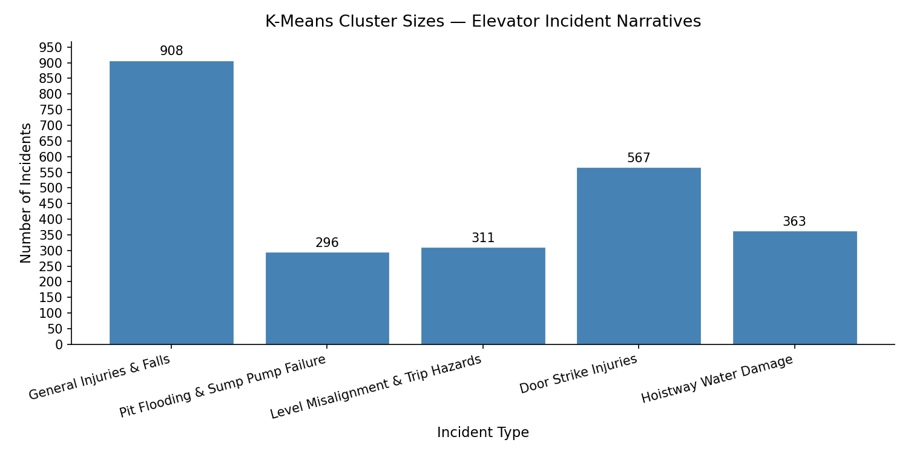

# Elevator Incident Analysis — Summary of Findings

**Prepared for:** Operations Management
**Date:** 2026-05-19
**Data source:** Ontario elevator incident reports (2,445 narratives)

---

An analysis of 2,445 elevator incident narratives identified five distinct incident types across Ontario's elevator fleet. The most common category — **General Injuries & Falls** — accounts for 908 incidents, nearly 37% of all reported events, spanning everything from passengers falling inside cars to injuries from sudden drops. The second largest category is **Door Strike Injuries** at 567 incidents, where passengers were hit, caught, or pinched by closing doors — a pattern that points directly to door sensor maintenance as a high-priority area for the operations team. **Hoistway Water Damage** (363 incidents) and **Pit Flooding & Sump Pump Failure** (296 incidents) together represent over 26% of all incidents; taken as a group, water intrusion is effectively the single largest systemic issue in the dataset, suggesting that waterproofing standards and sump pump inspection schedules deserve urgent review. **Level Misalignment & Trip Hazards** accounts for 311 incidents — elevators stopping slightly above or below the floor threshold — which is notable because it is a highly preventable mechanical fault that directly causes passenger falls. Perhaps the most surprising finding is that water-related events rival injury events in volume: most people think of elevators as a personal-safety risk, but the data shows that infrastructure and environmental damage is just as prevalent. The team's highest-leverage intervention would likely be a focused door sensor audit combined with a revised water-intrusion inspection protocol, as together those two categories account for nearly 60% of all recorded incidents.

---

## Incident Type Breakdown

| Incident Type | Count | Share |
|---|---|---|
| General Injuries & Falls | 908 | 37.1% |
| Door Strike Injuries | 567 | 23.2% |
| Hoistway Water Damage | 363 | 14.8% |
| Level Misalignment & Trip Hazards | 311 | 12.7% |
| Pit Flooding & Sump Pump Failure | 296 | 12.1% |

