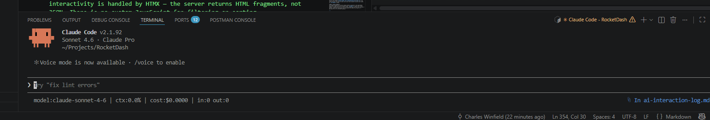

# Task 4 — Status Bar Notes

## Screenshot

---

## Status Bar Values Explained

The status bar produced by `scripts/statusline.sh` displays five values on a single line:

**`model`** — The Claude model currently handling the session (e.g., `claude-sonnet-4-6`). This confirms which model tier is being billed and what capability level is active.

**`ctx`** — Context window usage as a percentage. Calculated as input tokens used divided by the model's maximum context window. When this approaches 100%, the session is near its limit and older context will begin to be compressed or dropped.

**`cost`** — Total session cost in USD, accumulated across all turns since the session started. This is a running total, not a per-turn cost.

**`in`** — Input tokens consumed in the most recent turn. Includes the prompt, all conversation history, file contents read, and cached context loaded into the model.

**`out`** — Output tokens generated in the most recent turn. Output tokens are priced at 5× the rate of input tokens, so a long code-generation response has an outsized effect on cost.

---

## Cache Tokens: Read vs. Creation

Claude Code uses prompt caching to reduce cost on repeated context. Two token fields track how caching behaved in a given turn:

**`cache_creation_input_tokens`** — Tokens that were written into the cache for the first time. These tokens were processed at full input price and stored so they can be reused in future turns. A high value here means the session is building a cache — normal at the start of a conversation or after context changes significantly.

**`cache_read_input_tokens`** — Tokens that were served from the cache rather than reprocessed. These cost 90% less than standard input tokens. A high value here means caching is working: the model is reusing stable context (such as `CLAUDE.md`, unchanged file contents, or system instructions) without reprocessing it from scratch.

**What each tells you about caching health:** If `cache_read_input_tokens` is consistently high relative to `cache_creation_input_tokens`, prompt caching is working well and session costs are being reduced. If `cache_creation_input_tokens` dominates every turn, the cache is expiring frequently (the 5-minute TTL has elapsed between turns) or the context is changing too much between turns to benefit from caching.
